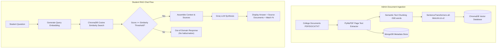

# AI-Powered College Information Assistant (RAG System)

A full-stack, enterprise-grade web application built to answer college-related student queries using **Retrieval-Augmented Generation (RAG)**.

Rather than relying on generic LLM responses, this system extracts text from uploaded official college documents (PDF, DOCX, TXT), converts chunks into high-dimensional vector embeddings, stores them in ChromaDB, retrieves relevant contexts via semantic similarity search, and synthesizes accurate answers using Groq LLM with strict source citations and relevance scores.

---

## 📐 System Architecture



---

## ✨ Features

- **Document-Verified RAG Pipeline:** Generates answers strictly from uploaded college documents.
- **Source Citations & Relevance Scores:** Shows exact document name, page number, department, and similarity match percentage (e.g. `92% Match`).
- **No Hallucination Handling:** Gracefully handles out-of-domain questions with clear non-retrieval warnings.
- **Department Filtering:** Supports department-specific document uploads (General, Computer Science, Electrical Engineering, Mechanical Engineering, Civil Engineering, Electronics).
- **Role-Based Authentication:** JWT-secured registration and login for Students and Admins.
- **Admin Document Control Center:** Upload new documents, track processing status (Processing, Processed, Failed), delete documents, and replace outdated files.
- **Analytics Dashboard:** Metrics for Total Documents, Registered Students, Total Questions Answered, and Processing Success Rates.
- **Suggested Questions:** One-click sample questions for attendance rules, hostel timings, fees, scholarships, and placements.
- **Interactive Feedback:** Thumbs-up 👍 / Thumbs-down 👎 response rating persisted in MongoDB.

---

## 🛠️ Technology Stack

- **Frontend:** React 18, Vite, Tailwind CSS, Lucide React, Axios, React Router v6
- **Backend:** Python 3.13, FastAPI, PyMuPDF (fitz), Pydantic v2, Motor (Async MongoDB), PyJWT, Passlib (Bcrypt)
- **AI & RAG:** SentenceTransformers (`all-MiniLM-L6-v2`), ChromaDB (Persistent Vector DB), Groq API (`llama-3.3-70b-versatile`)
- **Database:** MongoDB (Metadata, Users, Chat History, Feedback) & ChromaDB (Vector Embeddings)

---

## 🚀 Installation & Quick Start

### 1. Prerequisites
- Python 3.10+
- Node.js v18+ & npm
- MongoDB (Local daemon running on `localhost:27017` or MongoDB Atlas URI)

### 2. Backend Setup
```bash
cd backend

# Create virtual environment (optional but recommended)
python -m venv venv
venv\Scripts\activate  # Windows

# Install Python dependencies
pip install -r requirements.txt

# Create .env file from .env.example
cp .env.example .env
```

Configure `backend/.env`:
```ini
MONGO_URI=mongodb://localhost:27017
DB_NAME=college_rag_db
JWT_SECRET=super_secret_jwt_key_2026
GROQ_API_KEY=your_groq_api_key_here
GROQ_MODEL=llama-3.3-70b-versatile
CHROMA_DB_PATH=./chroma_db
EMBEDDING_MODEL=all-MiniLM-L6-v2
SIMILARITY_THRESHOLD=0.35
TOP_K=4
```

Start backend FastAPI server:
```bash
uvicorn main:app --reload --port 8000
```
Backend API interactive documentation will be available at `http://localhost:8000/docs`.

### 3. Frontend Setup
```bash
cd frontend

# Install npm dependencies
npm install

# Start Vite development server
npm run dev
```
Frontend will be accessible at `http://localhost:3000`.

---

## 🧪 Testing & Verification

### Generate Sample PDFs & Run Automated RAG Verification
We provide automated scripts to create 9 realistic sample college PDFs (Academic Regulations, Fee Structure, Hostel Rules, Examination Guidelines, Library Rules, Placement Info, Scholarship Info, Department Specs) and run test suites:

```bash
# 1. Generate sample college PDF files
python scripts/generate_sample_pdfs.py

# 2. Ingest PDFs into ChromaDB & test queries
python scripts/test_rag_pipeline.py
```

### Verified Test Cases:
1. **Attendance Query:** `What is the minimum attendance requirement?` -> Retrieves `Academic_Regulations.pdf` (Page 1, 75% attendance rule).
2. **Hostel Query:** `What are the hostel timings?` -> Retrieves `Hostel_Rules.pdf` (Page 1, 9:30 PM entry rule).
3. **Fee Query:** `What is the fee for the course?` -> Retrieves `Fee_Structure.pdf` (Page 1, INR 1,20,000 per annum).
4. **Out-of-Domain Query:** `What is the capital of France?` -> Score < 0.35 threshold -> Returns *"I couldn't find this information in the college knowledge base."*
5. **Dept Specific Query:** `What are the electrical engineering lab requirements?` -> Retrieves `Electrical_Engineering_Specs.pdf` (Page 1, insulated shoes & goggles).

---

## 🚢 Deployment Guide

### Frontend Deployment (Vercel)
1. Push `frontend/` directory to GitHub.
2. Import project into Vercel dashboard.
3. Set Environment Variable: `VITE_API_URL=https://your-backend-render-url.onrender.com/api`
4. Build command: `npm run build`, Output directory: `dist`.

### Backend Deployment (Render / Railway)
1. Push repository to GitHub.
2. Create a Web Service on Render specifying root directory `backend`.
3. Build Command: `pip install -r requirements.txt`
4. Start Command: `uvicorn main:app --host 0.0.0.0 --port $PORT`
5. Configure Environment Variables (`MONGO_URI`, `GROQ_API_KEY`, `JWT_SECRET`, etc.).

---

## 📋 Definition of Done Checklist

- [x] Student registration & login (JWT auth)
- [x] Admin registration & dashboard
- [x] PDF text extraction page-by-page using PyMuPDF
- [x] Text chunking with overlap & metadata attachment
- [x] Vector embedding generation using SentenceTransformers
- [x] ChromaDB persistent vector storage & similarity search
- [x] RAG prompt assembly with Groq API integration
- [x] Source citations (Document name, page number, relevance match %)
- [x] Out-of-domain query handling (No hallucination)
- [x] Chat history persistence in MongoDB
- [x] Admin document management (Upload, List, Delete, Department tagging)
- [x] Interactive thumbs-up/down feedback system
- [x] Automated testing suite (`scripts/test_rag_pipeline.py`)
- [x] Complete project documentation & build verification
